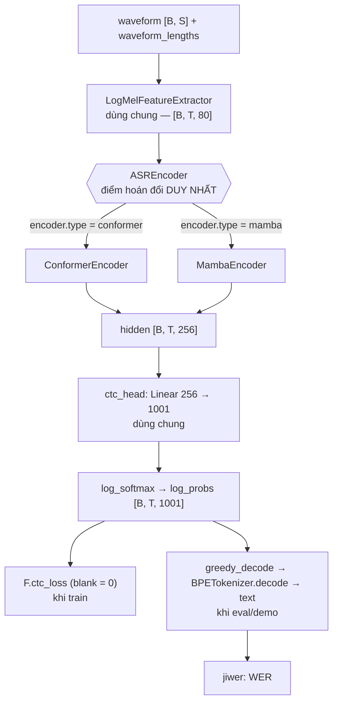
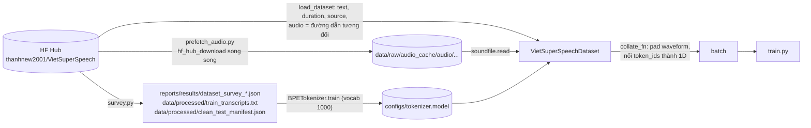
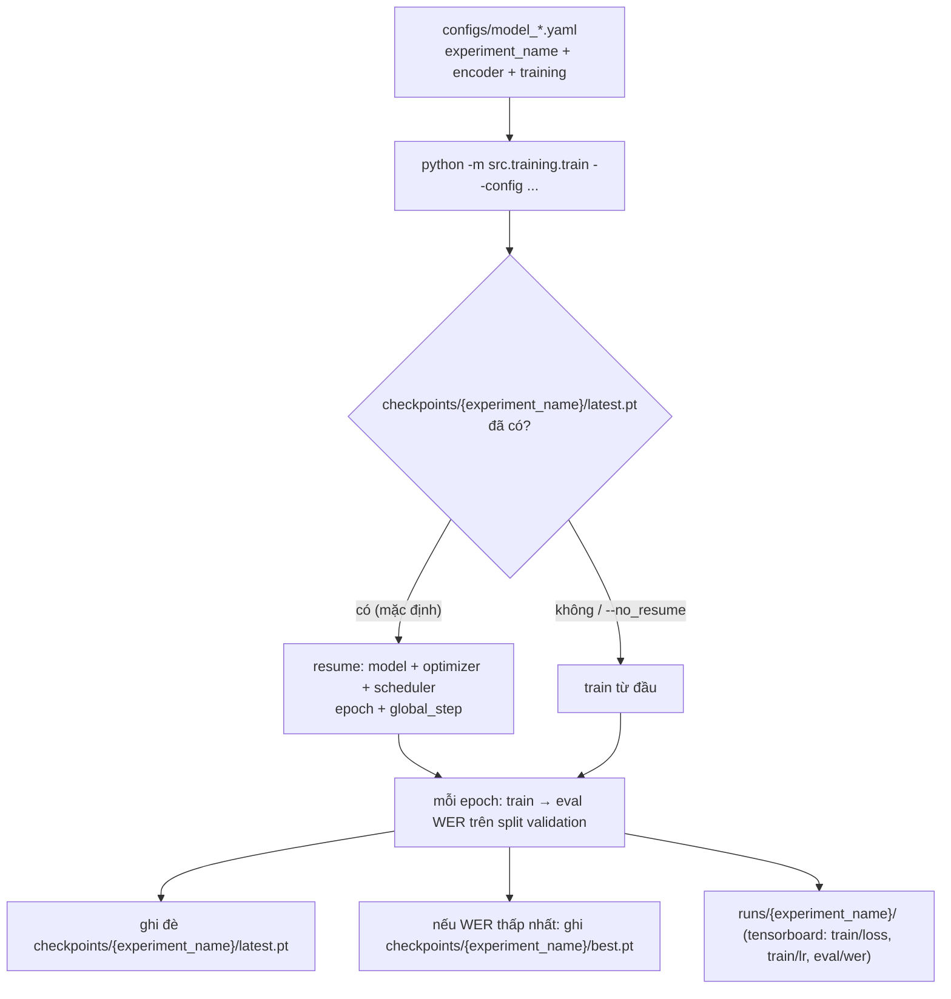
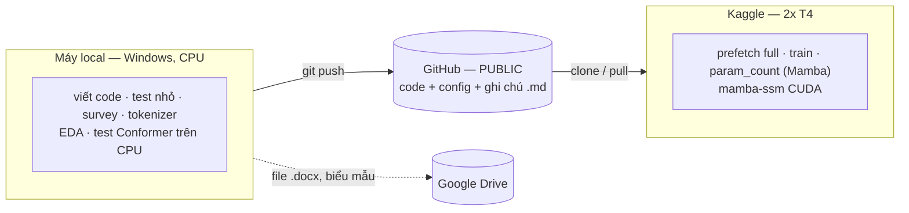

# ARCHITECTURE.md — Sơ đồ & luồng dữ liệu

Cập nhật lần cuối: 2026-09-19, đối chiếu với code tại commit `139f018`. Các
shape/số liệu dưới đây lấy từ code và từ lần chạy thử thật, không suy đoán.
Đổi luồng dữ liệu, shape hay interface thì sửa file này (xem
`docs/CONVENTIONS.md` mục 1). Trạng thái tiến độ ở `Plan.md`/`TODO.md`, không
ghi ở đây.

## 1. Bức tranh tổng thể

Một pipeline CTC duy nhất; hai thí nghiệm chỉ khác nhau ở encoder.

Phần **dùng chung** (không được lệch giữa hai thí nghiệm): front-end log-mel,
tokenizer, CTC head + loss, `train.py`, `evaluation/`, dataset/collate. Phần
**riêng**: chỉ `mamba_encoder.py` và `conformer_encoder.py`.

## 2. Luồng dữ liệu: từ HF Hub đến batch

| Bước | File | Vào → ra | Lưu ở |
|---|---|---|---|
| Khảo sát + tạo dữ liệu phụ | `src/data/survey.py` | stream 2 split → thống kê, corpus transcript, mẫu clean-test (250, seed 42, lấy từ `validation`) | `reports/results/`, `data/processed/` |
| Train tokenizer | `BPETokenizer.train` (gọi từ `survey.py`) | `train_transcripts.txt` → SentencePiece BPE | `configs/tokenizer.model` + `configs/tokenizer.vocab` (**track git**) |
| Liệt kê file cần tải | `prefetch_audio.needed_audio_paths` | 2 split → 67.405 đường dẫn | `data/processed/audio_manifest.json` (không track) |
| Tải audio | `prefetch_audio.prefetch_audio` | đường dẫn → file `.wav` (bỏ qua file đã có; lỗi từng file được gom, chạy lại là retry) | `data/raw/audio_cache/` |
| Đọc mẫu | `VietSuperSpeechDataset.__getitem__` | idx → `{waveform, text, token_ids}` (đọc cache; không có thì tải lẻ, chậm) | — |
| Gom batch | `collate_fn` | list mẫu → `waveform [B,S]` pad 0, `waveform_lengths [B]`, `targets` 1D nối, `target_lengths [B]`, `text` | — |

Repo HF có 118.259 file trong `audio/` nhưng train+validation chỉ dùng 67.405
→ prefetch tải đúng số cần dùng (không `snapshot_download` cả thư mục).

## 3. Luồng tensor (đã đo thật)

`S` = số sample (16 kHz), `B` = batch, `V` = vocab.

| Tầng | Vào | Ra | Ghi chú |
|---|---|---|---|
| Dataset | file wav | `waveform [S]` float | 10–15 s → S = 160.000–240.000 |
| `LogMelFeatureExtractor` | `[B, S]`, `[B]` | `feats [B, T, 80]`, `feat_lengths [B]` | `T = S//160 + 1` (hop 10 ms → **100 khung/giây**): 10 s → 1001, 13,4 s → 1341, 15 s → 1501. `log(clamp(mel, 1e-5))`. **Không** CMVN, **không** SpecAugment. |
| `ASREncoder.forward` | `feats`, `feat_lengths` | `hidden [B, T', 256]`, `out_lengths [B]` | **Cả hai encoder không subsampling: `T' = T`.** |
| `ctc_head` | `hidden` | `logits [B, T', V]` | `V = 1001` = 1000 piece BPE + blank (id 0) |
| `compute_loss` | `log_probs`, `targets`, lengths | scalar | chuyển thành `[T, B, V]` cho `F.ctc_loss`, `zero_infinity=True` |
| `greedy_decode` | waveform | `list[list[int]]` | argmax → gộp lặp → bỏ blank. Không beam search, không LM. |

Tokenizer: `encode` dịch mọi id SentencePiece lên +1 để id 0 dành cho CTC blank;
`decode` bỏ blank rồi dịch ngược. `vocab_size` (thuộc tính) = `get_piece_size() + 1`.
Transcript dataset **toàn chữ HOA, không dấu câu**; tokenizer train trên chính
nó nên hypothesis cũng chữ HOA — WER tính trực tiếp, không cần chuẩn hoá thêm.

## 4. Điểm hoán đổi: `ASREncoder`

Hợp đồng (`src/models/encoder_base.py`): `forward(feats [B,T,n_mels], feat_lengths [B])`
→ `(hidden [B,T',d_model], out_lengths [B])`; thuộc tính `output_dim`;
`num_parameters()`. `train.py::build_encoder` đọc `encoder.type` trong yaml
và là chỗ *duy nhất* khác nhau giữa hai nhánh.

| | `ConformerEncoder` | `MambaEncoder` |
|---|---|---|
| Nguồn | `torchaudio.models.Conformer` | `mamba_ssm.Mamba` (Mamba-1/S6, pin tag `v2.3.1`) |
| Đầu vào | `Linear(80 → 256)` | `Linear(80 → 256)` |
| Thân | 8 lớp, 4 head, ffn 1024, conv kernel 31, dropout 0,1 | 10 lớp (yaml): `x + Mamba(LayerNorm(x))`; d_state 16, d_conv 4, expand 2 |
| Ngữ cảnh | self-attention toàn chuỗi (2 chiều), chi phí O(T²) | quét **một chiều** trái→phải, chi phí O(T) |
| Padding | torchaudio tự mask theo `feat_lengths` | **không mask** (TODO trong code); trả `feat_lengths` nguyên vẹn |
| Cần | torch, torchaudio | GPU + kernel CUDA (`mamba-ssm`, `causal-conv1d`) — chỉ có trên Kaggle |
| Tham số | 12.204.288 với tham số mặc định của code | **chưa đo** (cần mamba-ssm); yaml đang đặt `n_layers: 10` để tiến tới khớp |

## 5. Vòng đời một thí nghiệm

Chạy lại đúng lệnh cũ là tự tiếp tục (Kaggle cắt session ~9–12 h). Đổi kiến trúc
mà giữ `experiment_name` thì dùng `--no_resume`.

## 6. Hai môi trường

| Thứ | Local | Kaggle | Đồng bộ? |
|---|---|---|---|
| Code, config, `docs/notes/*.md`, tokenizer, `clean_test_manifest.json` | ✔ | ✔ | qua git |
| `data/raw/audio_cache/` | tự tải | tự tải | **không** — mỗi nơi prefetch riêng |
| `checkpoints/`, `runs/` | — | ✔ | không (cần chủ động tải ra khỏi Kaggle) |
| GPU / `mamba-ssm` | không | có | — |
| File `.docx` | ✔ (bản đọc) | — | Google Drive |

Nơi chạy prefetch full và cách lưu cache trên Kaggle: **đang treo** — xem
`Plan.md` mục 5.

## 7. Bản đồ file

Ký hiệu: ✅ đã chạy thật · 🟡 chạy được một phần · ⬜ chưa có/rỗng.

| File | Vai trò | Trạng thái |
|---|---|---|
| `src/data/vietsuperspeech_dataset.py` | Dataset + `collate_fn`; `AUDIO_CACHE_DIR` | ✅ |
| `src/data/prefetch_audio.py` | Tải song song đúng 67.405 file; resume; `--verify` | 🟡 test 5 file thật + 1 lỗi cố ý; **chưa chạy full** |
| `src/data/survey.py` | Khảo sát, corpus transcript, clean-test, train tokenizer | ✅ |
| `src/features/log_mel.py` | Front-end log-mel | ✅ |
| `src/tokenizer/bpe_tokenizer.py` | BPE SentencePiece + blank id 0 | ✅ |
| `src/models/encoder_base.py` | Interface `ASREncoder` | ✅ |
| `src/models/conformer_encoder.py` | Encoder Conformer | ✅ (CPU) |
| `src/models/mamba_encoder.py` | Encoder Mamba | 🟡 kernel `mamba_ssm` chạy được trên T4; `MambaEncoder` + `train.py` **chưa** chạy qua |
| `src/models/ctc_model.py` | Front-end + encoder + CTC head, loss, greedy decode | ✅ (với Conformer) |
| `src/models/param_count.py` | So số tham số hai encoder | 🟡 chỉ nhánh Conformer; xem mục 8-f |
| `src/training/train.py` | Vòng train chung: checkpoint/resume, eval WER, tensorboard | ✅ Conformer (CPU) · ⬜ Mamba |
| `src/evaluation/wer.py` | `compute_wer`, `compute_wer_report` (jiwer) | ✅ (dùng trong eval loop) |
| `src/evaluation/rtf.py` | `measure_rtf` + bucket độ dài | ⬜ chưa chạy thật |
| `src/demo/` | Demo Gradio | ⬜ chỉ có `__init__.py` |
| *(chưa có)* | Script đo WER trên clean-test; script phân tích lỗi (error taxonomy, RQ3) | ⬜ |
| `configs/model_{conformer,mamba}.yaml` | 1 file = 1 thí nghiệm | ✅ |
| `notebooks/00_setup_environment.ipynb` | Kiểm tra/cài `mamba-ssm` trên Kaggle | ✅ |
| `notebooks/02_dataset_eda.ipynb` | EDA: waveform, spectrogram, nghe audio | ✅ |

## 8. Điều cần biết trước khi đụng code (đã xác minh từ code)

- **a. Đường dẫn tương đối theo cwd.** `AUDIO_CACHE_DIR = "data/raw/audio_cache"`
  → luôn chạy từ gốc repo.
- **b. `vocab_size` thật là 1001.** Khoá `tokenizer.vocab_size` và
  `data.sample_rate` trong yaml **không được `train.py` đọc** (nó lấy từ
  tokenizer thật); chỉ mang tính ghi chú.
- **c. Không resample.** `sf.read` bỏ qua sample rate; code giả định file 16 kHz
  và không kiểm tra.
- **d. Không subsampling.** `T' = T` ≈ 1000–1500 khung cho mỗi mẫu. Ảnh hưởng
  VRAM/`batch_size`, chi phí attention của Conformer, và cách đọc kết quả RQ2.
- **e. Mamba đơn hướng, không mask padding.** Khác biệt về ngữ cảnh giữa hai
  encoder là thuộc tính kiến trúc, cần nêu trong phần thảo luận (chưa thấy repo
  ghi lại). TODO mask padding trong `mamba_encoder.py` vẫn mở.
- **f. `param_count.py` không đọc yaml.** Nó gọi `MambaEncoder()` /
  `ConformerEncoder()` với tham số mặc định (Mamba mặc định `n_layers=8`, yaml
  đặt 10). Chỉnh yaml **không** đổi kết quả của script → phải sửa script để đọc
  yaml trước khi dùng nó tune (đang ở `TODO.md` 🟡).
- **g. `train.py` còn đơn giản.** 1 GPU (không DataParallel/DDP — dù Kaggle có 2
  T4), không AMP, không bucketing theo độ dài, không SpecAugment. Loss in ra mỗi
  epoch là loss của batch cuối, không phải trung bình. Eval = greedy trên toàn
  bộ `validation` (6.749 mẫu) mỗi epoch.
- **h. Chọn model và báo cáo chung một nguồn.** `best.pt` chọn theo WER
  `validation`; clean-test (250) lại được lấy từ chính `validation`. Số WER báo
  cáo cuối nên đo bằng script riêng trên clean-test (chưa có), lưu ý điều này khi
  diễn giải.
- **i. Bucket độ dài theo đề cương, không theo dữ liệu.** `rtf.py`
  (`3–30 s`) và `survey.py` chia bucket theo giả định của đề cương, trong khi
  dữ liệu thật chỉ 10–15 s. **Không sửa** khi quyết định 🔴 về RQ2 chưa có
  (`docs/notes/dataset_discrepancy.md`).
- **j. Docstring lỗi thời (chỉ là chữ, chưa sửa).**
  `vietsuperspeech_dataset.py` còn nhắc `snapshot_download` (đã bỏ, xem mục 2);
  `wer.py` ghi "dev-test" (tên thật: `validation`).
