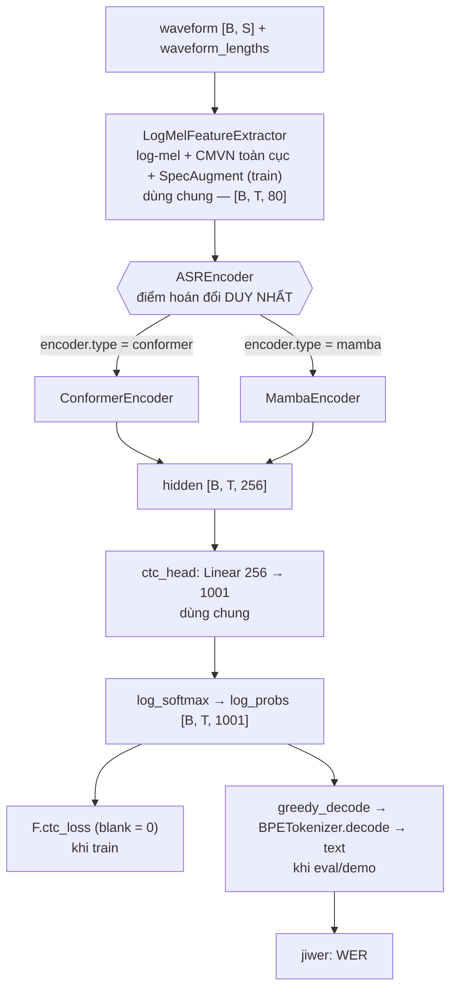
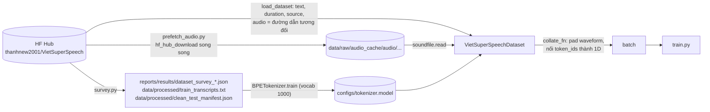
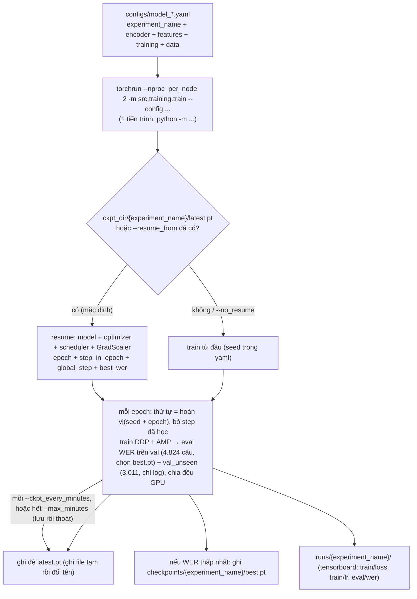
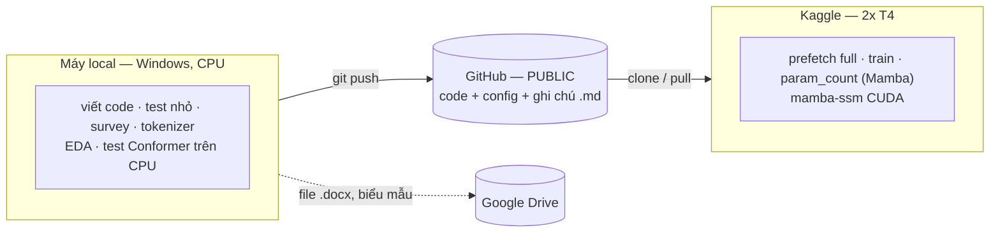

# ARCHITECTURE.md — Sơ đồ & luồng dữ liệu

Cập nhật lần cuối: 2026-10-04 (bước 3 code dùng chung + front-end CMVN/SpecAugment,
chưa commit; trước đó đối chiếu commit `139f018`). Các
shape/số liệu dưới đây lấy từ code và từ lần chạy thử thật, không suy đoán.
Đổi luồng dữ liệu, shape hay interface thì sửa file này (xem
`docs/CONVENTIONS.md` mục 1). Trạng thái tiến độ ở `Plan.md`/`TODO.md`, không
ghi ở đây.

## 1. Bức tranh tổng thể

Một pipeline CTC duy nhất; hai thí nghiệm chỉ khác nhau ở encoder.

```mermaid
flowchart TD
    W["waveform [B, S] + waveform_lengths"] --> FE["LogMelFeatureExtractor<br/>log-mel + CMVN toàn cục + SpecAugment (train)<br/>dùng chung — [B, T, 80]"]
    FE --> ENC{{"ASREncoder<br/>điểm hoán đổi DUY NHẤT"}}
    ENC -->|"encoder.type = conformer"| C["ConformerEncoder"]
    ENC -->|"encoder.type = mamba"| M["MambaEncoder"]
    C --> H["hidden [B, T, 256]"]
    M --> H
    H --> HEAD["ctc_head: Linear 256 → 1001<br/>dùng chung"]
    HEAD --> LP["log_softmax → log_probs [B, T, 1001]"]
    LP --> LOSS["F.ctc_loss (blank = 0)<br/>khi train"]
    LP --> DEC["greedy_decode → BPETokenizer.decode → text<br/>khi eval/demo"]
    DEC --> WER["jiwer: WER"]
```

Phần **dùng chung** (không được lệch giữa hai thí nghiệm): front-end log-mel,
tokenizer, CTC head + loss, `train.py`, `evaluation/`, dataset/collate. Phần
**riêng**: chỉ `mamba_encoder.py` và `conformer_encoder.py`.

## 2. Luồng dữ liệu: từ HF Hub đến batch

```mermaid
flowchart LR
    HF[("HF Hub<br/>thanhnew2001/VietSuperSpeech")]
    HF -->|"load_dataset: text, duration, source,<br/>audio = đường dẫn tương đối"| DS["VietSuperSpeechDataset"]
    HF -->|"prefetch_audio.py<br/>hf_hub_download song song"| CACHE[("data/raw/audio_cache/audio/...")]
    CACHE -->|"soundfile.read"| DS
    HF -->|"survey.py"| SV["reports/results/dataset_survey_*.json<br/>data/processed/train_transcripts.txt<br/>data/processed/clean_test_manifest.json"]
    SV -->|"BPETokenizer.train (vocab 1000)"| TOK[("configs/tokenizer.model")]
    TOK --> DS
    DS -->|"collate_fn: pad waveform,<br/>nối token_ids thành 1D"| B["batch"]
    B --> TR["train.py"]
```

| Bước | File | Vào → ra | Lưu ở |
|---|---|---|---|
| Khảo sát + tạo dữ liệu phụ | `src/data/survey.py` | stream 2 split → thống kê, corpus transcript, mẫu clean-test (250, seed 42, lấy từ `validation`) | `reports/results/`, `data/processed/` |
| Train tokenizer | `BPETokenizer.train` (gọi từ `filter_language.py --train-tokenizer`; bản đầu từ `survey.py`) | nhãn đúng tập train — 4 shard, bỏ A1 + video giữ riêng (`data/processed/train_transcripts_filtered.txt`, 45.442 dòng) → SentencePiece BPE | `configs/tokenizer.model` + `configs/tokenizer.vocab` (**track git**) |
| Liệt kê file cần tải | `prefetch_audio.needed_audio_paths` | 2 split → 67.405 đường dẫn | `data/processed/audio_manifest.json` (không track) |
| Tải audio | `prefetch_audio.prefetch_audio` | đường dẫn → file `.wav` (bỏ qua file đã có; lỗi từng file được gom, chạy lại là retry) | `data/raw/audio_cache/` |
| Chia shard + val (D3, D5) | `src/data/make_shards.py` | 2 split ở `HF_REVISION` + clean-test → 4 shard train (vòng tròn qua video, seed 42) + val = `validation` trừ clean-test; kiểm bất biến rồi mới ghi; `--check` đọc lại | `data/splits/*.tsv` (`index`, `audio`, `duration` theo index split) + `summary.json` (**track git**) |
| Lọc ngôn ngữ / nhãn hỏng (A1) | kernel `scripts/kaggle/lid/lid.py` → `src/data/filter_language.py` | LID Whisper-small trên audio 67.405 đoạn + tỉ lệ từ có dấu của nhãn → loại đoạn audio không phải `vi`, 149 video phỏng vấn nước ngoài, nhãn < 20% dấu. Áp ở bước đọc (`manifest_rows`, `eval_clean_test`), **không** sửa manifest/tar | `data/processed/lid.csv` (không track) → `data/splits/excluded.tsv` (`split`, `index`, `audio`, `reason`; **track git**) |
| Tạo Kaggle Dataset (D6) | `scripts/kaggle/make_dataset/make_dataset.py` | 1 phần manifest → tải HF, kiểm (đủ file, 16 kHz mono, duration) → `<part>.tar` + `<part>.tsv` | output kernel CPU |
| Giải nén tar (Kaggle) | `src/data/extract_audio.py` | `*.tar` dưới `/kaggle/input` → `/tmp/audio_cache/audio/...`, kiểm đủ file theo `<part>.tsv`, bỏ qua tar đã giải nén | `/tmp/audio_cache` (đặt `AUDIO_CACHE_DIR`) |
| Giữ riêng video test (2026-10-04) | `src/data/make_heldout.py` | câu có trong 5 dataset, bỏ A1 → 29 video ngẫu nhiên (seed 42, ≥ 20 câu, ~6% giờ) → clean-test 7 câu/video + phần còn lại val_unseen; kiểm rời nhau | `data/splits/heldout_videos.tsv`, `data/splits/val_unseen.tsv` (có cột `split`), `data/processed/clean_test_manifest.json` bản 2 (mỗi câu có `split`) — **track git** |
| Chọn mẫu | `manifest_rows(names)` | tên manifest → `[{split, index, audio, duration}]`; luôn bỏ `excluded.tsv`; manifest shard (`train_shard*`, `val`) bỏ thêm video giữ riêng: 4 shard = 45.442, `train_shard0` = 11.364, val = 4.824, `val_unseen` = 3.011 |
| Thống kê CMVN | `src/features/compute_cmvn.py` | 2000 câu ngẫu nhiên (seed 42) từ train đã lọc → mean/std 80 kênh | `configs/cmvn_stats.json` (**track git**) |
| Đọc mẫu | `VietSuperSpeechDataset(tokenizer=…, items=[(split, index)])` (vẫn nhận `split` + `indices` kiểu cũ) | vị trí → (split, index) HF, trộn được hai split → `{waveform, text, token_ids}`; HF pin `HF_REVISION`; audio đọc từ `AUDIO_CACHE_DIR` (biến môi trường, mặc định `data/raw/audio_cache`), thiếu thì tải lẻ (chậm) | — |
| Gom batch | `collate_fn` | list mẫu → `waveform [B,S]` pad 0, `waveform_lengths [B]`, `targets` 1D nối, `target_lengths [B]`, `text` | — |

Repo HF có 118.259 file trong `audio/` nhưng train+validation chỉ dùng 67.405
→ prefetch tải đúng số cần dùng (không `snapshot_download` cả thư mục).

## 3. Luồng tensor (đã đo thật)

`S` = số sample (16 kHz), `B` = batch, `V` = vocab.

| Tầng | Vào | Ra | Ghi chú |
|---|---|---|---|
| Dataset | file wav | `waveform [S]` float | 10–15 s → S = 160.000–240.000 |
| `LogMelFeatureExtractor` | `[B, S]`, `[B]` | `feats [B, T, 80]`, `feat_lengths [B]` | `T = S//160 + 1` (hop 10 ms → **100 khung/giây**): 10 s → 1001, 13,4 s → 1341, 15 s → 1501. `log(clamp(mel, 1e-5))` → CMVN toàn cục `(x − mean)/std` (buffer, lưu trong checkpoint) → SpecAugment **chỉ khi `training`**: 2 mask tần số F=27 + 10 mask thời gian ≤ 5% độ dài thật, điền 0, không time warp. Luôn fp32 kể cả dưới AMP. Cấu hình ở mục `features` của yaml (từ 2026-10-04, căn cứ `docs/notes/frontend_decoder_survey.md`) |
| `ASREncoder.forward` | `feats`, `feat_lengths` | `hidden [B, T', 256]`, `out_lengths [B]` | **Cả hai encoder không subsampling: `T' = T`.** |
| `ctc_head` | `hidden` | `logits [B, T', V]` | `V = 1001` = 1000 piece BPE + blank (id 0) |
| `ctc_loss` (hàm, `ctc_model.py`) | `log_probs`, `out_lengths`, `targets`, lengths | scalar | ép fp32, chuyển `[T, B, V]` cho `F.ctc_loss`, `zero_infinity=True`. `train.py` gọi `model(...)` (qua DDP) rồi hàm này; `compute_loss` chỉ còn là tiện ích |
| `greedy_decode` | waveform | `list[list[int]]` | argmax → gộp lặp → bỏ blank. Không beam search, không LM. |

Tokenizer: `encode` dịch mọi id SentencePiece lên +1 để id 0 dành cho CTC blank;
`decode` bỏ blank rồi dịch ngược. `vocab_size` (thuộc tính) = `get_piece_size() + 1`.
Transcript dataset **toàn chữ HOA, không dấu câu**; tokenizer train trên chính
nó nên hypothesis cũng chữ HOA. Từ 2026-10-02 **mọi WER đi qua
`normalize_text`** (`src/evaluation/text_normalize.py`, gọi bên trong
`compute_wer`/`compute_wer_report`): NFC, chữ thường, dấu câu → khoảng trắng —
để so được với mô hình pre-train ra chữ hoa/dấu câu. Với nhãn hiện có chỉ đổi
hoa/thường (+29 dấu `-`, 5 ký tự `<` trên 60.656 câu) nên WER không đổi.

## 4. Điểm hoán đổi: `ASREncoder`

Hợp đồng (`src/models/encoder_base.py`): `forward(feats [B,T,n_mels], feat_lengths [B])`
→ `(hidden [B,T',d_model], out_lengths [B])`; thuộc tính `output_dim`;
`num_parameters()`. `train.py::build_encoder` đọc `encoder.type` trong yaml
và là chỗ *duy nhất* khác nhau giữa hai nhánh. `train.py::build_model` dựng
model đầy đủ (front-end từ mục `features` + encoder + CTC head) — dùng ở
`train.py`, `eval_clean_test.py`, kernel benchmark; đừng tự gọi `CTCASRModel(...)`
ở chỗ mới kẻo thiếu CMVN.

| | `ConformerEncoder` | `MambaEncoder` |
|---|---|---|
| Nguồn | `torchaudio.models.Conformer` | `mamba_ssm.Mamba` (Mamba-1/S6, pin tag `v2.3.1`) |
| Đầu vào | `Linear(80 → 256)` | `Linear(80 → 256)` |
| Thân | 8 lớp, 4 head, ffn 1024, conv kernel 31, dropout 0,1 | 14 lớp hai chiều B1 (yaml, từ 2026-10-02): `h = LN(x); x = x + drop(Mamba_xuôi(h)) + drop(rev(Mamba_ngược(rev(h))))`, dropout 0,1 (từ 2026-10-04), `rev` = đảo theo `feat_lengths` từng mẫu (`reverse_padded`); rồi `norm_f`. d_state 16, d_conv 4, expand 2. Cờ `bidirectional: false` → bản một chiều cũ `x + Mamba(LN(x))` |
| Ngữ cảnh | self-attention toàn chuỗi (2 chiều), chi phí O(T²) | quét **hai chiều** (2 lần quét/lớp, 28 khối), chi phí O(T) |
| Padding | torchaudio tự mask theo `feat_lengths` | không mask tường minh: nhánh ngược đảo theo độ dài thật nên padding luôn ở cuối theo chiều quét (mục 8-e); trả `feat_lengths` nguyên vẹn |
| Cần | torch, torchaudio | GPU + kernel CUDA (`mamba-ssm`, `causal-conv1d`) — chỉ có trên Kaggle |
| Tham số | 12.204.288 (theo yaml, đo bằng `param_count.py`) | 12.285.696 (+0,67%) với B1 `n_layers: 14` — đếm bằng khối giả cùng shape `mamba_ssm.Mamba` v2.3.1 (2026-10-02), **chưa đo trên Kaggle**. Bản một chiều 28 lớp: 12.292.864 (đo 12.292.352 trên T4 2026-09-24 + 512 `norm_f`) |

## 5. Vòng đời một thí nghiệm

```mermaid
flowchart TD
    Y["configs/model_*.yaml<br/>experiment_name + encoder + features + training + data"] --> T["torchrun --nproc_per_node 2 -m src.training.train --config ...<br/>(1 tiến trình: python -m ...)"]
    T --> R{"ckpt_dir/{experiment_name}/latest.pt<br/>hoặc --resume_from đã có?"}
    R -->|"có (mặc định)"| RES["resume: model + optimizer + scheduler + GradScaler<br/>epoch + step_in_epoch + global_step + best_wer"]
    R -->|"không / --no_resume"| NEW["train từ đầu (seed trong yaml)"]
    RES --> LOOP
    NEW --> LOOP["mỗi epoch: thứ tự = hoán vị(seed + epoch), bỏ step đã học<br/>train DDP + AMP → eval WER trên val (4.824 câu, chọn best.pt) + val_unseen (3.011, chỉ log), chia đều GPU"]
    LOOP -->|"mỗi --ckpt_every_minutes, hoặc hết --max_minutes (lưu rồi thoát)"| LATEST
    LOOP --> LATEST["ghi đè latest.pt (ghi file tạm rồi đổi tên)"]
    LOOP --> BEST["nếu WER thấp nhất: ghi checkpoints/{experiment_name}/best.pt"]
    LOOP --> TB["runs/{experiment_name}/ (tensorboard: train/loss, train/lr, eval/wer)"]
```

Chạy lại đúng lệnh cũ là tự tiếp tục, kể cả giữa epoch (Kaggle cắt session
~9–12 h). Checkpoint lưu `n_train`: resume với tập train khác số câu thì báo
lỗi. Đổi kiến trúc mà giữ `experiment_name` thì dùng `--no_resume`. Train thử
1 shard: `--train_manifests train_shard0 --epochs 5` với `--ckpt_dir` riêng.

## 6. Hai môi trường

```mermaid
flowchart LR
    subgraph L["Máy local — Windows, CPU"]
      L1["viết code · test nhỏ · survey · tokenizer<br/>EDA · test Conformer trên CPU"]
    end
    GH[("GitHub — PUBLIC<br/>code + config + ghi chú .md")]
    subgraph K["Kaggle — 2x T4"]
      K1["prefetch full · train · param_count (Mamba)<br/>mamba-ssm CUDA"]
    end
    L -->|"git push"| GH
    GH -->|"clone / pull"| K
    L -.->|"file .docx, biểu mẫu"| D[("Google Drive")]
```

| Thứ | Local | Kaggle | Đồng bộ? |
|---|---|---|---|
| Code, config, `docs/notes/*.md`, tokenizer, `clean_test_manifest.json` | ✔ | ✔ | qua git |
| `data/raw/audio_cache/` | tự tải | tự tải | **không** — mỗi nơi prefetch riêng |
| `checkpoints/`, `runs/` | — | ✔ | không (cần chủ động tải ra khỏi Kaggle) |
| GPU / `mamba-ssm` | không | có | — |
| File `.docx` | ✔ (bản đọc) | — | Google Drive |

Nơi chạy prefetch full và cách lưu cache trên Kaggle: **đang treo** — xem
`Plan.md` mục 5.

## 7. Bản đồ file

Ký hiệu: ✅ đã chạy thật · 🟡 chạy được một phần · ⬜ chưa có/rỗng.

| File | Vai trò | Trạng thái |
|---|---|---|
| `src/data/vietsuperspeech_dataset.py` | Dataset + `collate_fn`; `AUDIO_CACHE_DIR` | ✅ |
| `src/data/prefetch_audio.py` | Tải song song đúng 67.405 file; resume; `--verify` | 🟡 test 5 file thật + 1 lỗi cố ý; **chưa chạy full** |
| `src/data/survey.py` | Khảo sát, corpus transcript, clean-test, train tokenizer | ✅ |
| `src/data/make_shards.py` | Manifest 4 shard + val, kiểm rời nhau/đủ/không lẫn val; `--check` | ✅ 2026-09-30 chạy full dữ liệu thật |
| `src/data/extract_audio.py` | Giải nén tar dataset Kaggle vào `/tmp/audio_cache` | 🟡 viết 2026-10-04, test local bằng tar nhỏ; chưa chạy trên Kaggle |
| `src/features/log_mel.py` | Front-end log-mel + CMVN toàn cục + SpecAugment | ✅ test local 2026-10-04 (CMVN đúng công thức, mask không lọt padding, eval không mask) |
| `src/features/compute_cmvn.py` | Thống kê CMVN → `configs/cmvn_stats.json` | ✅ chạy thật 2026-10-04 (2000 câu) |
| `src/tokenizer/bpe_tokenizer.py` | BPE SentencePiece + blank id 0 | ✅ |
| `src/models/encoder_base.py` | Interface `ASREncoder` | ✅ |
| `src/models/conformer_encoder.py` | Encoder Conformer | ✅ (CPU) |
| `src/models/mamba_encoder.py` | Encoder Mamba (hai chiều B1 + cờ một chiều) | 🟡 B1 test CPU bằng khối giả (shape, padding, tham số, weight decay) 2026-10-02; **chưa** chạy với kernel CUDA thật |
| `src/models/ctc_model.py` | Front-end + encoder + CTC head, loss, greedy decode | ✅ (với Conformer) |
| `src/models/param_count.py` | So số tham số hai encoder, đọc yaml qua `build_encoder` | 🟡 Conformer ✅ (12.204.288) · Mamba chưa đo (cần CUDA); xem mục 8-f |
| `src/training/train.py` | Vòng train chung: DDP `torchrun` + SyncBN + AMP, sampler resume giữa epoch, `--max_minutes`, checkpoint theo phút, eval chia GPU, tensorboard | 🟡 viết lại 2026-10-04: Conformer CPU (1 tiến trình + DDP gloo 2 tiến trình) · ⬜ GPU/NCCL/AMP · ⬜ Mamba |
| `src/evaluation/wer.py` | `compute_wer`, `compute_wer_report` (jiwer), tự chuẩn hóa ref/hyp qua `normalize_text` | ✅ (dùng trong eval loop) |
| `src/evaluation/text_normalize.py` | Chuẩn hóa văn bản dùng chung cho **mọi** mô hình trước WER; `is_vietnamese_label` (heuristic < 20% từ có dấu, **chưa kiểm chứng** — A1) | ✅ 2026-10-02 test local |
| `src/evaluation/rtf.py` | `measure_rtf` + bucket độ dài | ⬜ chưa chạy thật |
| `src/demo/` | Demo Gradio | ⬜ chỉ có `__init__.py` |
| `src/evaluation/eval_clean_test.py` | Đo WER checkpoint trên clean-test → `reports/results/<exp>_clean_test.json` (ref/hyp từng câu) | 🟡 chạy thật với dữ liệu thật (Conformer, CPU, trọng số ngẫu nhiên — chưa có checkpoint train) · Mamba ⬜ |
| *(chưa có)* | Script phân tích lỗi (error taxonomy, RQ3) | ⬜ |
| `configs/model_{conformer,mamba}.yaml` | 1 file = 1 thí nghiệm | ✅ |
| `notebooks/00_setup_environment.ipynb` | Kiểm tra/cài `mamba-ssm` trên Kaggle | ✅ |
| `notebooks/02_dataset_eda.ipynb` | EDA: waveform, spectrogram, nghe audio | ✅ |
| `scripts/kaggle/verify_mamba.py` | Kernel GPU: build wheel mamba, `param_count`, smoke test cả hai encoder | ✅ 2026-09-24 |
| `scripts/kaggle/check_env/check_env.py` | Kernel CPU (D9): đĩa, tốc độ tải HF, số file output, tốc độ tar | ✅ 2026-09-28 |
| `scripts/kaggle/zero_shot/zero_shot.py` | Kernel GPU: zero-shot Parakeet-CTC-0.6B-vi / PhoWhisper-small / wav2vec2-base-vi trên 250 câu clean-test (tải từ HF), greedy không LM, WER 2 mức + RTF + VRAM → `results.json`, `predictions.tsv` | 🟡 2026-10-02 chạy thật CPU local 4 câu cả 3 mô hình · **chưa chạy Kaggle** |
| `scripts/kaggle/benchmark/benchmark.py` | Kernel GPU (D9): s/step theo `num_workers` / AMP / 2 GPU × 2 encoder; tự viết vòng step, không gọi `train.py` | ✅ 2026-09-30 chạy đủ 8 cấu hình trên Kaggle (kết quả: `docs/notes/training_plan_kaggle.md` mục 5) · lần 3 (Mamba B1 + `CHECK_CODE` kiểm padding/tham số bằng kernel thật) sửa sẵn 2026-10-02, **chưa chạy** |
| `scripts/kaggle/make_dataset/make_dataset.py` | Kernel CPU (D6): tạo 1 trong 5 dataset (sửa `PART`), kiểm WAV sau tải | 🟡 test local 20 file thật · chưa chạy trên Kaggle (cần push manifest) |
| `scripts/kaggle/**/kernel-metadata.json` | Cấu hình kernel (chứa username) — **gitignore**, giữ local | — |

## 8. Điều cần biết trước khi đụng code (đã xác minh từ code)

- **a. Đường dẫn tương đối theo cwd.** `AUDIO_CACHE_DIR = "data/raw/audio_cache"`
  → luôn chạy từ gốc repo.
- **b. `vocab_size` thật là 1001.** Khoá `tokenizer.vocab_size` và
  `data.sample_rate` trong yaml **không được `train.py` đọc** (nó lấy từ
  tokenizer thật); chỉ mang tính ghi chú.
- **c. Không resample.** `sf.read` bỏ qua sample rate; code giả định file 16 kHz
  và không kiểm tra.
- **d. Không subsampling.** `T' = T` ≈ 1000–1500 khung cho mỗi mẫu. Ảnh hưởng
  VRAM/`batch_size`, chi phí attention của Conformer, và cách đọc kết quả RQ2.
- **e. Mamba hai chiều B1, padding xử lý bằng đảo theo độ dài (2026-10-02).**
  Lý do chuyển và phương án: `docs/notes/mamba_bidirectional.md`. Nhánh ngược
  dùng `reverse_padded` (gather theo `feat_lengths`), **không** `torch.flip` cả
  tensor — flip đưa padding lên đầu chuỗi, lọt vào trạng thái scan (test đối
  chứng: lệch ~1e-1). Nhờ vậy với mọi khối padding luôn nằm *sau* khung thật
  theo chiều quét, conv1d + scan nhân quả → không cần mask; CTC chỉ tính trên
  `feat_lengths`. Ai sửa forward phải giữ bất biến này (vd. thêm subsampling
  thì phải tính lại `feat_lengths` *trước* khi đảo). Với cờ một chiều, lập
  luận cũ vẫn đúng.
- **e2. Theo khuyến nghị tác giả Mamba (rà 2026-09-30, mamba-ssm v2.3.1).**
  `MambaEncoder` tự thêm những gì `MixerModel` có mà khối `Mamba` lẻ không có:
  `norm_f`, chia `out_proj` cho √(số khối cộng vào residual) — B1: √(2 × 14)
  = √28, cả hai nhánh — residual fp32. `n_layers` trong yaml là số *lớp*;
  B1 mỗi lớp 2 khối nên 14 lớp = 28 khối, 56 tham số miễn weight decay. `build_optimizer`
  miễn weight decay cho tham số `_no_weight_decay` (`A_log`, `D`); Conformer
  không bị ảnh hưởng (đã kiểm: tham số giống hệt từng bit so với AdamW cũ).
  Khi thêm AMP: dùng `torch.autocast` + tham số fp32, **không** `.half()`.
- **f. `param_count.py` đọc yaml (sửa 2026-09-21).** Dựng encoder bằng
  `build_encoder` của `train.py` nên số đo = dòng "encoder params" của lúc
  train. Import `train.py` kéo theo tensorboard/tensorflow (~vài chục giây khởi
  động). Nhánh Mamba chỉ chạy khi có `mamba-ssm` (Kaggle); local chỉ ra số
  Conformer. Chỉ đếm encoder, không gồm CTC head.
- **g. `train.py` (viết lại 2026-10-04, bước 3 `TODO.md`).** DDP khi có
  `WORLD_SIZE` > 1 (`torchrun`), batch toàn cục = `batch_size` yaml chia đều
  GPU; SyncBN chỉ khi có CUDA; AMP fp16 (`training.amp`, CPU tự tắt) — front-end
  và CTC loss luôn fp32. Gọi `model(...)` qua wrapper DDP rồi `ctc_loss`, **không**
  `module.compute_loss` (bỏ qua đồng bộ gradient). Quyết định theo đồng hồ
  (checkpoint/dừng) do rank 0 phát cho mọi rank, nếu không DDP treo. Không
  bucketing theo độ dài. Loss in mỗi epoch là trung bình các step của phiên.
  Eval = greedy trên val (4.824 câu, chọn `best.pt`) và `extra_eval_manifests`
  (val_unseen 3.011 câu, log `eval/wer_val_unseen`).
- **h. Chọn model và báo cáo tách tập (D5).** `best.pt` chọn theo WER val =
  `validation` trừ clean-test cũ, trừ video giữ riêng; clean-test (203 câu) và
  val_unseen lấy từ **29 video giữ riêng** — không video nào có trong train/val
  (từ 2026-10-04). val vẫn rải từ video train nên WER val lạc quan hơn. Số WER báo
  cáo cuối nên đo bằng `eval_clean_test.py` trên clean-test, lưu ý điều này khi
  diễn giải.
- **i. Bucket độ dài theo đề cương, không theo dữ liệu.** `rtf.py`
  (`3–30 s`) và `survey.py` chia bucket theo giả định của đề cương, trong khi
  dữ liệu thật chỉ 10–15 s. **Không sửa** khi quyết định 🔴 về RQ2 chưa có
  (`docs/notes/dataset_discrepancy.md`).
- **k. Bản chép `text_normalize.py` trong kernel `zero_shot`.** Kernel chỉ
  upload 1 file nên nhúng nguyên văn module dạng chuỗi; sửa module thì phải chép
  lại (kernel tự so khớp với repo local/GitHub và báo nếu lệch).
- **j. Docstring lỗi thời — đã sửa 2026-09-21** (`vietsuperspeech_dataset.py`,
  `wer.py`).
